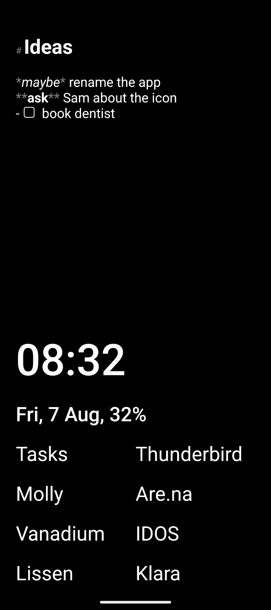
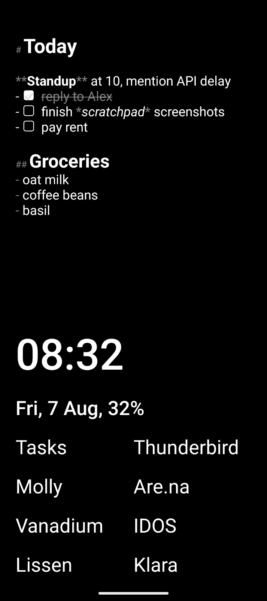

# Scratchpad Launcher

**A minimal Android home screen that's also a piece of paper.**

The top half is a plain text box that's always there: write something down without opening an app, and it's still there after a reboot. The bottom half is a small, fixed list of apps. Nothing else.

  
  

## Features

- **Always-visible scratchpad**: unlock your phone and start typing. Notes are saved as you type and survive reboots.
- **Light markdown**: `# headings`, `**bold**`, `*italic*`, `- lists` and `- [ ]` checkboxes you can tick with a tap.
- **Type to launch**: swipe up, type a few letters, and the app opens as soon as there's only one match.
- **Sync as `scratchpad.md`**: optionally mirror the scratchpad into a folder, e.g. an Obsidian vault synced to your other devices.
- **Small, fixed app list**: a handful of apps with no icons and no clutter. Rename, hide, and align them.
- **Gestures**: double tap to lock, swipe left/right to open apps, swipe down for notifications or search.
- **Readable**: separate text sizes for the scratchpad and the rest of the launcher, plus light and dark themes.
- **Works with** dual apps, work profiles and private space.

## Privacy

No accounts, no analytics, no ads, and no network calls except links you tap yourself. Scratchpad text is stored locally in its own preferences file and excluded from Android auto-backup, so it never leaves the device unless you turn on folder sync yourself.

The optional accessibility service is used only for double-tap-to-lock. It's off by default and collects nothing.

## Why

Sometimes you just want to write something down and have it always visible, without opening any app. This is a fork of [Olauncher](https://github.com/tanujnotes/Olauncher), a minimal, ad-free Android launcher, with the app grid cut down and a persistent scratchpad put in its place.

Feedback and bug reports are welcome in [Issues](https://github.com/mstcgalis/scratchpad-launcher/issues).

## Development

Single Gradle module, built with [`just`](https://github.com/casey/just): `just build`, `just test`, `just lint`, `just run` (install on a connected device), `just release VERSION`.

## License

[GNU GPLv3](https://www.gnu.org/licenses/gpl-3.0.en.html), inherited from [Olauncher](https://github.com/tanujnotes/Olauncher) by [tanujnotes](https://github.com/tanujnotes). This fork builds on Olauncher v6.7.19.
